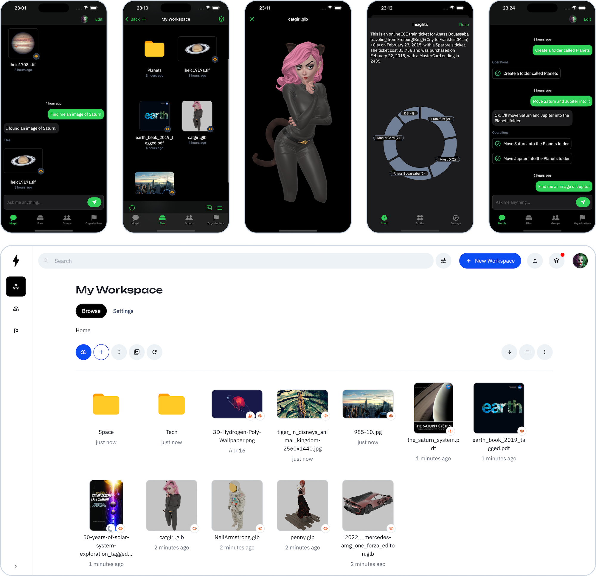

<!-- markdownlint-disable MD033 MD041 -->
<p align="center">
  
  <h1 align="center">Voltaserve</h1>
</p>

<h3 align="center">Cloud Storage for Creators</h2>

<p align="center">
  <a href="https://apps.apple.com/app/id6744360805">
    
  </a>
  <a href="https://apps.apple.com/mac/app/id6744360805">
    
  </a>
</p>

<p align="center">
  <a href="https://youtu.be/sCfvdj49WBw">▶ Talk to your files and manilulate them</a>
  <br/>
  <a href="https://youtu.be/Uf3EWb2hDfs">▶ Your creative private cloud</a>
</p>

Voltaserve is the cloud storage where you can talk to your files and manipulate them. This is unprecedented, and it’s designed for creative minds. If you are a digital artist, photographer, content creator, journalist, or a musician — Voltaserve is built for you.



## Getting Started

### Optional Murph Setup

To take advantage of Murph, you will need a Google Gemini API key, in this case, edit the [.env](.env) file as follows:

```properties
VOLTASERVE_LLM_GEMINI_API_KEY=YOUR_GOOGLE_GEMINI_API_KEY_HERE
```

Replace the placeholder `YOUR_GOOGLE_GEMINI_API_KEY_HERE` with the actual value.

### Run Your Instance

Pull images: (_recommended for most users_)

```shell
docker compose pull
```

Optionally build the images from the source: (_can be skipped if you pulled the images_)

```shell
docker compose build
```

Start containers:

```shell
docker compose up -d
```

Wait until the following containers are running:

- `voltaserve-api`
- `voltaserve-idp`
- `voltaserve-conversion`
- `voltaserve-webdav`
- `voltaserve-language`
- `voltaserve-mosaic`
- `voltaserve-console`
- `voltaserve-murph`
- `voltaserve-ui`

> **Note**
>
> You can check that by running the command `docker ps` and look at the `STATUS` column.

Create an account and sign in:

1. Go to the **sign up page** <http://localhost:3000/sign-up> and create an account.

2. Open MailDev <http://localhost:8025>, select the received email and click the **confirm email** link.

3. Finally, go to the **sign in page** <http://localhost:3000/sign-in> and login with your credentials.

> **Note**
>
> Voltaserve supports [WebDAV](https://en.wikipedia.org/wiki/WebDAV) and by default it listens on port `8082`.

### The iOS App (iPad, iPhone and Mac)

Download on the [App Store](https://apps.apple.com/app/id6744360805), or the [Mac App Store](https://apps.apple.com/mac/app/id6744360805).

Watch [Murph in action](https://youtu.be/sCfvdj49WBw) on the iPad and iPhone, or a [walkthrough video](https://youtu.be/RpHp0OEa_o8) of various capabilities.

Voltaserve’s iOS app defines a gold standard; it’s fully native, optimized for iPad and iPhone, runs beautifully on the Mac, features a slick user interface with real-time updates, and is built using Apple’s flagship framework, SwiftUI.

After launching the app, you’ll be asked to review and accept the Privacy Policy and Terms & Conditions.

Once accepted, you’ll see a button labeled “New Server” in the center of the screen under the logo. Please tap it and enter the following details to connect to your Voltaserve instance:

| Field                 | Value                       |
| --------------------- | --------------------------- |
| Name                  | My Voltaserve               |
| API URL               | `http://your-hostname:8080` |
| Identity Provider URL | `http://your-hostname:8081` |
| Murph URL (optional)  | `http://your-hostname:8087` |

Replace `your-hostname` with the actual hostname, domain or IP address of your Voltaserve instance.

> **Note**
>
> Murph URL is optional, it can be omitted if you don't have a Google Gemini API key.

You can keep the "Sign In Strategy" as "Apple" so you can sign in easily with your Apple account, or switch it to "Local" for a traditional sign up with email confirmation, for this you need to make sure your SMTP server is up and running as documented further down.

After saving, you will be able to sign in.

The core of the iOS app is open source and available [here](https://github.com/kouprlabs/voltaserve-ios).

### Mount the Drive on Your Computer

We recommend the following third-party applications:

- [Mountainduck](https://mountainduck.io)
- [Owlfiles](https://www.skyjos.com/owlfiles)

### Connect with WebDAV

We recommend the following third-party applications:

- [Documents](https://readdle.com/documents)
- [Owlfiles](https://www.skyjos.com/owlfiles)
- [Cyberduck](https://cyberduck.io)
- [WinSCP](https://winscp.net)
- [Rclone](https://rclone.org/webdav)

### Configuration

Update the `VOLTASERVE_HOSTNAME` environment variable in [.env](.env) file to match your hostname (it can optionally be an IP address as well):

```properties
VOLTASERVE_HOSTNAME="your-hostname"
```

Update the following environment variables in [.env](.env) file to match your SMTP server:

```properties
VOLTASERVE_SMTP_HOST="your-smtp-hostname"
VOLTASERVE_SMTP_PORT=587
VOLTASERVE_SMTP_SECURE=true
VOLTASERVE_SMTP_USERNAME="your-smtp-user"
VOLTASERVE_SMTP_PASSWORD="your-smtp-password"
VOLTASERVE_SMTP_SENDER_ADDRESS="no-reply@your-domain"
VOLTASERVE_SMTP_SENDER_NAME="Voltaserve"
```

The port `3000` is used for the UI, therefore it needs to be open and accessible from the outside. One way of doing it in Linux is by using `ufw`:

```shell
sudo ufw allow 3000
```

> **Note**
>
> You can change the UI port to something else, other than `3000`, like `80` for example. This can be done by editing the `VOLTASERVE_UI_PORT` environment variable in [.env](.env) file as follows:

```properties
VOLTASERVE_UI_PORT=80
```

The port `8082` is used for WebDAV, you can change it by editing the `VOLTASERVE_WEBDAV_PORT` environment variable in [.env](.env) file as follows:

```properties
VOLTASERVE_WEBDAV_PORT=8082
```

The port needs to be open and accessible from the outside. One way of doing it in Linux is by using `ufw`:

```shell
sudo ufw allow 8082
```

Other ports can be changed as well by editing their respective environment variables in [.env](.env) file.

## Troubleshooting

**My containers have issues starting up, what should I do?**

One reason might be that some ports are already allocated on your machine, in this case you can change the Voltaserve ports in [.env](.env) file.

**I'm not happy with `localhost`, can I change it?**

You can achieve this by changing the `VOLTASERVE_HOSTNAME` environment variable in [.env](.env) file.

It can be any IP address, like:

```properties
VOLTASERVE_HOSTNAME="192.168.1.100"
```

Or any custom hostname, like:

```properties
VOLTASERVE_HOSTNAME="your-hostname"
```

## Development

To setup a development environment for the purpose of developing and debugging Voltaserve, please read the development documentation available [here](DEVELOPMENT.md).

## Licensing

Voltaserve is released under the [Business Source License 1.1](LICENSE).
